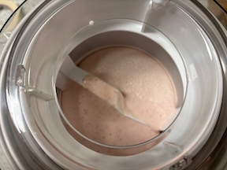

I've never been a fan of strawberry ice cream—it usually tastes too artificial. But could making it from scratch change my mind? To find out, I whipped up a pint using fresh strawberries and a few simple ingredients. The recipe I reviewed is from [A Latte Food](https://www.alattefood.com/homemade-strawberry-ice-cream/).

The recipe calls for 2/3 to 1½ cups of strawberries, depending on whether you puree them or leave them chopped in the base. I chose to puree them for the smoothest possible base, using 1 cup of strawberries.

The base churned for about 15 minutes. Unlike most recipes I've tried that overwhelm the Ice-21, this recipe worked perfectly in the machine. I'll definitely scale up the quantity next time since there was plenty of room.

### **Flavor: 18**

The flavor was clean and refreshing. However, after working through two scoops, I found myself wanting more strawberry intensity. As a stand-alone dessert without mix-ins, this recipe would benefit from additional strawberries.

### **Texture: 20**

This surprised me, as I expected more ice crystals to form—especially given how quickly the base churned to solid form. I think the texture score could be higher if I hadn't pureed all the strawberries. The puree method left some gritty texture from the high concentration of strawberries in the base. Keeping some strawberry chunks might have reduced this grittiness.

TIL: The "seeds" on the outside of a strawberry are called achenes. Each achene is actually a tiny, dry fruit containing a seed. The red, fleshy part of the strawberry isn't the true fruit at all—it's an enlarged receptacle that holds these achenes. 🤯

### **Appearance: 20**

Compared to the artificial coloring of commercial strawberry ice cream, pureeing fresh strawberries creates a more subdued appearance. While small gritty particles are visible in the base, making it somewhat plain, the natural strawberry color is authentic. Adding strawberry chunks would have made for a more visually appealing dessert.

### **Aftertaste: 17**

After one scoop, the aftertaste was hardly noticeable. After two scoops, a coating developed on the tongue—not the most unpleasant, but definitely present.

### Final Score: 75

[alattefood.com’s Homemade Strawberry Ice Cream recipe](https://www.alattefood.com/homemade-strawberry-ice-cream/) was a solid choice! I’d definitely make it again, but next time, I’ll include strawberry chunks to enhance both the flavor and texture while reducing the grittiness. This might also improve the aftertaste and mouthfeel.

<iframe src="https://app.freezethepint.com/ice-cream/homemade-strawberry-ice-cream" title="Gallery of frozen dessert recipes."></iframe>

