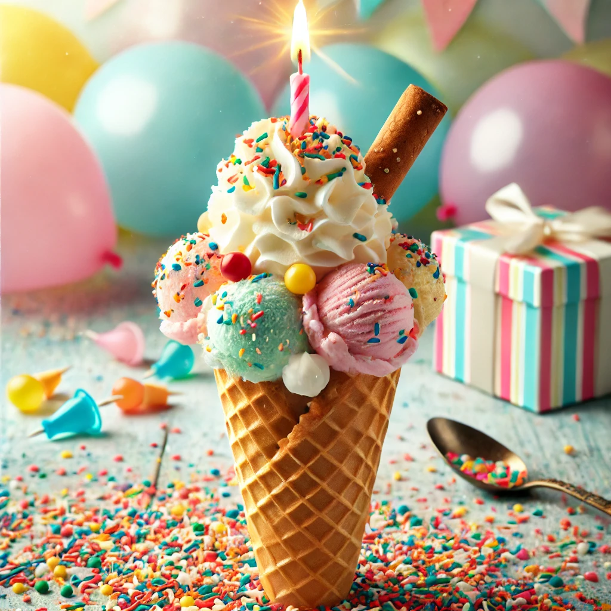

## This was AI Generated 😃

Birthday cake ice cream is not the easiest to make because it requires a delicate balance of flavors and textures to truly capture the essence of a classic birthday cake. The base must have a rich, buttery vanilla or cake batter flavor, which often involves carefully incorporating cake mix or emulsified flavor extracts without affecting the ice cream’s smooth texture. Additionally, mix-ins like cake pieces, frosting swirls, and sprinkles need to be added strategically—too early, and they may dissolve or become mushy; too late, and they won’t distribute evenly. Maintaining the right consistency while preventing the cake chunks from becoming too soggy or frozen solid adds another layer of complexity. Finally, achieving the signature sweetness without overwhelming the palate requires careful ingredient balancing, making birthday cake ice cream a challenge to perfect.

