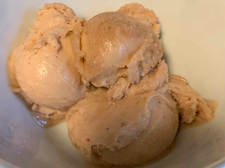

Over the past year, I got caught up in the hype surrounding the Ninja Creami Deluxe. It was a fantastic machine that worked wonders—until it started malfunctioning after ~75 spins. I’ll likely dive into that experience in a future post. But despite the setback, it got me hooked on making ice cream. My first creation was a simple strawberry banana ice cream, made with just strawberries and bananas 🤯

During my time with the Ninja Creami, I wanted a way to keep track of the recipes I was making and the changes I’d experiment with. That’s when I created [freezethepint.com](http://freezethepint.com/). The site was initially just a place to host the recipes I tried and track modifications made along the way. But if anyone is reading this, you know it has become much more… a blog.

<u>Future posts will consists of:</u>

- reviews of other’s ice cream recipes
- random rants related to ice cream
- random (probably impressive) experiments related to ice cream

Honestly, this whole blog adventure is a way for me to build a blogging platform from the ground up. This post is written within a Notion database entry. It will eventually be pulled through the Node Notion SDK, converted into markdown via a GitHub Action, committed to my [freeze-the-pint-blog](https://github.com/carlknutson/freeze-the-pint-blog) repository, processed by the Eleventy framework, and, finally, published to `freezethepint.com`.

Thanks for joining me on this sweet journey.

<iframe src="[https://app.freezethepint.com/sorbet/strawberry-banana](https://app.freezethepint.com/sorbet/strawberry-banana)" title="Gallery of frozen dessert recipes."></iframe>

